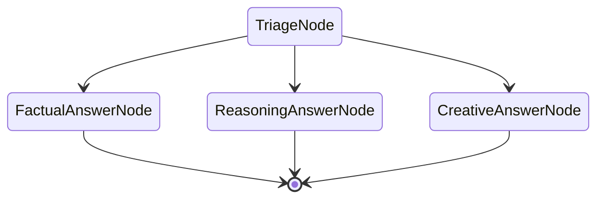
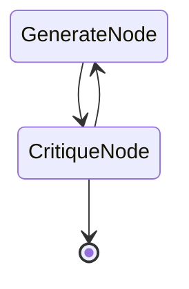

# three-layer-agent

A minimal toy demonstrating the three-layer composition for typed agent pipelines:

1. **DSPy Signature** — declarative reasoning contract (typed I/O fields + docstring instruction)
2. **PydanticAI Agent** — runtime, built from the signature's output type and docstring
3. **pydantic-graph** — typed state machine that wires agents together with explicit transitions

Plus the **GEPA hook** via `Agent.override(instructions=...)` for runtime prompt injection after offline optimization.

## Why this stack

- **Signatures are declarative, not runtime.** DSPy provides the declarative contract (field types, descriptions, instruction docstring); PydanticAI is the actual LM runtime. DSPy's `Predict` / `ChainOfThought` / `ReAct` modules are deliberately not used.
- **Each layer does one thing.** Signatures declare information flow. PydanticAI enforces output shape and handles multi-provider structured-output repair. `pydantic-graph` enforces execution order with typed state transitions. `gepa` (offline) optimizes instructions.
- **Replaces LangGraph `StateGraph`.** No LangChain dependency; cleaner composition with DSPy signatures; native support for `Agent.override()` as the GEPA injection hook.

## Files

- `toy.py` — linear two-node pipeline (Triage → Answer). Demonstrates the core composition + GEPA override hook.
- `toy_branching.py` — branching state graph with runtime routing (Triage → one of three category-specific Answer nodes). Demonstrates real FSM behavior with type-directed transitions.
- `toy_loop_persist.py` — critic loop (Generate → Critique → loop back or end) with both `FullStatePersistence` (in-memory trajectory) and `FileStatePersistence` (JSON on disk, resumable after crash).
- `toy_gepa_optimize.py` — closes the loop: offline GEPA optimization of a DSPy Signature's instruction, producing the artifact that `Agent.override()` consumes at runtime. Custom `GEPAAdapter` bridges GEPA's candidate dict to the PydanticAI agent. Demonstrates train 75% → 100% lift from an adversarial seed.
- [`fitness_coach/`](./fitness_coach/) — multi-session agentic toy exercising the elements the four single-session toys don't: longitudinal state, session-handoff document, evidence with provenance, per-step validation with deterministic fallback, tiered safety overrides, cross-population generality (powerlifters + runners), side-by-side comparison vs. a rigid expert-system "straw coach". Also includes [`fitness_coach/optimize.py`](./fitness_coach/optimize.py) — a focused GEPA optimization that lifts a stripped-back `PlanSignature` from 17% to 83% pass rate. 9-node FSM with 76 unit tests. See [`fitness_coach/README.md`](./fitness_coach/README.md).

## Run

```bash
uv run python toy.py
uv run python toy_branching.py
uv run python toy_loop_persist.py
uv run python toy_gepa_optimize.py
```

Requires `OPENAI_API_KEY` and `ANTHROPIC_API_KEY` in environment. Uses `gpt-4o-mini` (Triage) and `claude-haiku-4-5` (Answer) — demonstrates heterogeneous-model composition; costs pennies per run.

## The state graph

`toy_branching.py` renders to this Mermaid diagram, auto-generated from `run()` return-type annotations:



Transitions are declared in the type system. Each node's `run()` method has a return annotation (e.g., `-> FactualAnswerNode | ReasoningAnswerNode | CreativeAnswerNode`) that tells `pydantic-graph` which transitions are legal. Runtime routing happens inside the node based on state content:

```python
match ctx.state.triage.category:
    case "factual":    return FactualAnswerNode()
    case "reasoning":  return ReasoningAnswerNode()
    case "creative":   return CreativeAnswerNode()
```

`toy_loop_persist.py` shows the loop-back pattern:



The loop is declared by `CritiqueNode.run() -> GenerateNode | End[AcceptedDraft]` — the Union makes both transitions legal. The runtime decision (loop back or end) depends on state content (the critic's accept/reject verdict).

## The composition pattern

```python
# 1. DSPy Signature — declarative contract
class TriageSignature(dspy.Signature):
    """Classify a user question and produce a one-sentence approach plan."""
    question: str = dspy.InputField(desc="The user's question.")
    triage: Triage = dspy.OutputField(desc="Classification and approach plan.")


# 2. PydanticAI Agent — derived from the signature
def agent_from_signature(sig, model, ...) -> Agent:
    output_type = next(iter(sig.output_fields.values())).annotation
    return Agent(
        model=model,
        output_type=output_type,
        instructions=sig.instructions,
    )


# 3. pydantic-graph Node — wires the agent into the FSM
@dataclass
class TriageNode(BaseNode[PipelineState]):
    async def run(self, ctx) -> AnswerNode:
        agent = agent_from_signature(TriageSignature, model="openai:gpt-4o-mini")
        result = await agent.run(format_prompt_from_signature(TriageSignature, ...))
        ctx.state.triage = result.output
        return AnswerNode()


# 4. GEPA hook — inject optimized instructions at runtime, no mutation
with agent.override(instructions=gepa_optimized_text):
    result = await agent.run(prompt)
```

## Who owns what

| Concern | Owned by |
|---|---|
| Reasoning contract (fields, types, descriptions) | DSPy Signature |
| Default instruction text | DSPy Signature docstring |
| Optimized instruction text | External prompt store, injected via `Agent.override()` |
| Output schema enforcement + repair | PydanticAI (`output_type`, `ModelRetry`) |
| Tool calling | PydanticAI (`@agent.tool`) |
| Multi-provider output normalization | PydanticAI adapters |
| Execution order + typed state | `pydantic-graph` |
| State persistence, resumability | `pydantic-graph` (`FileStatePersistence`) |
| Prompt optimization (offline) | `gepa` package + `Agent.override()` |

## References

- DSPy: https://github.com/stanfordnlp/dspy
- PydanticAI: https://ai.pydantic.dev/
- pydantic-graph: https://ai.pydantic.dev/graph/
- GEPA: Agrawal et al. 2025 (ICLR 2026) — reflective prompt evolution
- Canonical GEPA + PydanticAI pattern (Pydantic team): https://pydantic.dev/articles/prompt-optimization-with-gepa

## Context

Pattern reference for structured multi-session agentic systems where deterministic rules need to constrain and validate LLM reasoning at every step. The composition was validated end-to-end with the included demos before being adopted in larger LA3D projects.
