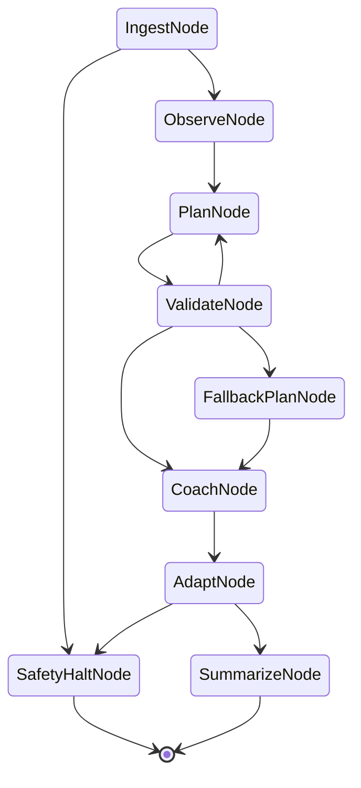

# fitness_coach — multi-session agentic toy

A worked example showing that the three-layer stack (DSPy Signature + PydanticAI Agent + pydantic-graph + GEPA) supports the architectural elements the four single-session toys (`toy.py`, `toy_branching.py`, `toy_loop_persist.py`, `toy_gepa_optimize.py`) don't yet exercise. Strength training and recreational running are the chosen domain because they have well-published deterministic methodologies (Rippetoe Starting Strength, Daniels' Running Formula) that supply both the rule layer and the evaluator's grounding rubric — no domain expert in the loop required.

## What this toy demonstrates

The other four toys are all single-session and memoryless. This one exercises seven architectural elements that real multi-session agentic systems need:

| Element | Where it shows up here |
|---|---|
| Multi-session longitudinal state | `AthleteState` evolves across 6 sessions per athlete |
| Session-to-session handoff document | `SummarizeNode` produces a `HandoffDoc` that the next session's `PlanNode` reads as primary context |
| Evidence with provenance | `EvidenceItem` carries explicit `source` + `trust_weight`; `ObserveSignature` reasons about provenance |
| Per-step validation catching reasoning errors | `ValidateNode` deterministic check; up to 2 plan retries; then `FallbackPlanNode` |
| Tiered safety overrides | Two layers, two severities. **High/critical** signal at `IngestNode` halts the whole session via `SafetyHaltNode`. **Moderate** signal halts the offending movement via `movements_to_halt` → `ValidateNode` (rejects any plan that includes the halted movement; `PlanNode` is also told upfront in the prompt). `AdaptNode` independently safety-checks proposed state transitions against methodology thresholds. |
| Cross-population generality | Same graph + signatures + evaluator serve powerlifters AND runners; only `schemas.py` + `methodology.py` + `synthetic.py` differ per population |
| Side-by-side comparison vs. rigid expert system | `straw_coach.py` mechanically follows linear progression / Daniels rules with no awareness of pain, sleep, or evidence |

## The state graph



Two safety-halt paths (from input log / from AdaptNode proposal). Plan-validation loop-back capped at 2 retries → deterministic fallback. The transitions are declared by `run()` return-type annotations; pydantic-graph builds the FSM from them.

## File layout

```
fitness_coach/
├── schemas.py            # Pydantic models + discriminated-union AthleteState
├── methodology.py        # Rippetoe + Daniels rules + safety thresholds (deterministic)
├── synthetic.py          # 4 athletes × 6 sessions; 2 surprise sessions per athlete
├── straw_coach.py        # Rigid baseline: fails dramatically on surprises, by design
├── signatures.py         # 5 DSPy signatures (Observe, Plan, Coach, Adapt, Summarize)
├── graph.py              # 9-node pydantic-graph FSM + SessionState
├── evaluator.py          # 4-axis methodology-grounded judge
├── run.py                # Side-by-side demo entry point + per-session trace persistence
├── optimize.py           # GEPA optimization of PlanSignatureMinimal
├── traces/               # FileStatePersistence outputs (gitignored)
└── tests/
    ├── test_schemas.py   # 23 round-trip + discriminated-union tests
    ├── test_methodology.py  # 38 readiness, safety, validation, fallback tests
    └── test_evolve_state.py # 11 idempotency, sparse-week, injury-reset tests
```

## Cross-population: same architecture, different schemas

`AthleteState` is a discriminated union (`Annotated[Union[PowerlifterState, RunnerState], Field(discriminator="population")]`), NOT a Protocol. Pydantic cannot validate Protocols inside `OutputField` / `InputField`, so the choice is forced by the schema-enforcement boundary at the PydanticAI / DSPy layer.

| Concern | Powerlifter | Runner |
|---|---|---|
| Activity vocabulary | `LiftActivity` (squat/bench/deadlift/ohp/row) | `RunActivity` (easy/tempo/interval/long/recovery) |
| State fields | `current_lifts: dict[str, float]`, `consecutive_failed_sessions` | `vdot`, `current_weekly_mileage`, `weeks_at_current_mileage` |
| Methodology | `LinearProgression` (Rippetoe; +5/+2.5 lb increments; 3-failure deload) | `DanielsRunning` (Daniels; +10%/wk cap; 80/20 distribution) |
| Safety threshold | Pain ≥ moderate → halt movement | Pain or injury recurrence → halt activity |

What stays the same across populations:
- `graph.py` — every node, every transition
- `signatures.py` — all 5 reasoning contracts
- `evaluator.py` — the 4-axis judge (with population-specific methodology context strings injected at call time)
- `run.py` — orchestration loop

## Synthetic data

4 athletes:
- `pl_001` "Sam" — early novice powerlifter; smooth progression with 1 bad-sleep session and 1 deadlift PR
- `pl_002` "Diane" — stalling intermediate; 3-session bench plateau, then moderate shoulder pain
- `rn_001` "Marco" — beginner half-marathon trainee; work-travel skipped week, then knee twinge
- `rn_002` "Priya" — returning runner with ITB history; form regression mid-cycle, ITB warning at week 6

Each athlete has 6 sessions × ~3-5 activities each, with explicit `EvidenceItem` streams (`source`, `trust_weight`, `content`) and `SafetySignal`s where present. The data is grounded in published methodology (Rippetoe Starting Strength; Daniels' Running Formula).

## Running the demo

```bash
# All 4 athletes, side-by-side comparison + 4-axis evaluator scores
uv run python -m fitness_coach.run

# Subset for faster iteration or cost control
uv run python -m fitness_coach.run --athletes pl_002

# GEPA optimization of PlanSignatureMinimal (separate artifact, see below)
uv run python -m fitness_coach.optimize

# Tests
uv run pytest fitness_coach/tests/ -v
```

Requires `OPENAI_API_KEY` in environment (default model: `openai:gpt-4o-mini`). Cost: ~$0.30 per full demo run; ~$0.30 per `optimize.py` run.

The demo prints a per-athlete timeline with 4-axis scores (Plan Quality, Coaching Specificity, Adaptation Appropriateness, Safety Adherence) for both straw and agentic systems, plus a summary breaking down the gap on routine vs. surprise sessions.

## Trace persistence

Per-session trajectories are saved as JSON to `traces/{athlete_id}/session_{n}.json` via `FileStatePersistence`. These are GEPA-ready training data — every node transition, the state before and after, and the agent outputs are captured.

## GEPA optimization (`optimize.py`)

A separate artifact that demonstrates what GEPA recovers when the `PlanSignature` docstring is stripped to a one-sentence contract.

`optimize.py` defines a `PlanSignatureMinimal` with the same I/O contract as `signatures.PlanSignature` but a terse single-sentence docstring. It then runs GEPA against 6 hand-picked eval cases (powerlifter healthy / plateau / shoulder pain; runner healthy / ITB / returning from skip), scoring plans by `methodology.validate_plan` (binary pass/fail respecting `halted_movements`).

Result on a fresh run (60 metric calls, gpt-4o-mini task LM, gpt-4o reflection LM):

| | Seed | Optimized |
|---|---|---|
| Instruction length | 56 chars | ~1700 chars |
| Pass rate (6 cases) | **17%** (1/6) | **83%** (5/6) |
| Lift | — | **+67 pp** |

GEPA's optimized text rebuilds — without hand-engineering — the deload-after-3-failures rule, the 80/20 easy-distribution, the ≥3-runs-per-runner-week minimum, and the halted-movement omission. In other words, the elaboration that the production `PlanSignature` ships with hand-tuned in the docstring is the kind of content GEPA can derive from a tight contract + an evaluation function.

**Critical setup detail:** `PlanGEPAAdapter` constructs its agent with `model_settings={"temperature": 0.0}`. With default temperature, the same prompt produces different plans across runs and GEPA's signal is dominated by sampling noise (we measured 17%, 50%, 83% on identical inputs across re-runs). Always set `temperature=0` when using GEPA against an LLM agent — see [`PlanGEPAAdapter.__init__`](./optimize.py) for the canonical setup.

The single remaining failure (rn_002 ITB case in our latest run) is an LLM schema slip — gpt-4o-mini occasionally produces non-`RunActivity` entries even with explicit instructions. That's a compliance issue no amount of prompt tuning fully fixes; in production the graph's `ValidateNode` + 2-retry + `FallbackPlanNode` is the right answer for that class of error.

## When this pattern is useful elsewhere

Any multi-session agentic system where:

- Longitudinal state evolves across sessions and the next session's planning depends on prior context
- A deterministic rule layer (here, training methodology) sets safety and progression constraints the LLM cannot bypass
- Evidence comes from multiple streams with varying trust (here: athlete self-report vs. objective metric vs. coach observation)
- A handoff document between sessions is the right level of context-compression — not a vector retrieval over raw episodes
- The same architecture should serve multiple populations with different schemas and constraints

Domains where this shape applies: tutoring across sessions, longitudinal coaching of any kind (writing, music practice), agent-driven project management with weekly cycles, plant-care advisors with recurring observations, RPG game-master agents that track campaign state across play sessions.
